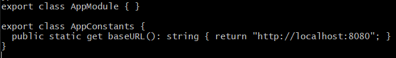
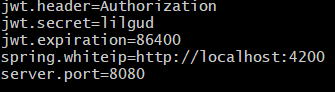

# Swoosh
### Агрегатор автомоек

## Запуск проекта

Надо установить docker, docker-compose и склонировать репозиторий

```
sudo apt update
sudo apt install docker
sudo apt install docker-compose
git clone https://gitlab.com/Timkar164/swoosh.git
cd swoosh/frontend
```

Перед тем как собрать **front**:

```
cd src/app
nano app.module.ts
```

Меняем в классе AppConstants - **host**:



```
Ctrl + X   // Выход из редактора
y          // Сохранить - да
Enter      // Подтвердить название файла
```

Далее собираем **front**:

```
cd ../..
sudo docker image build -t front:1.0 .
sudo docker container run -d -p 4200:80 --name=frontend front:1.0
```

Перед тем как собрать **back**:

```
cd ../backend/src/main/resources
nano application.properties
```

Меняем **spring.whiteip**:



```
Ctrl + X   // Выход из редактора
y          // Сохранить - да
Enter      // Подтвердить название файла
```

Собираем **back**:

```
cd ../../..
sudo docker-compose up -d --build
```